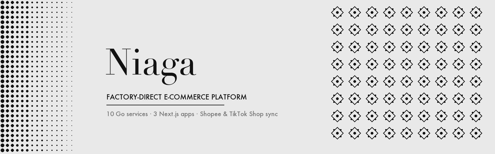
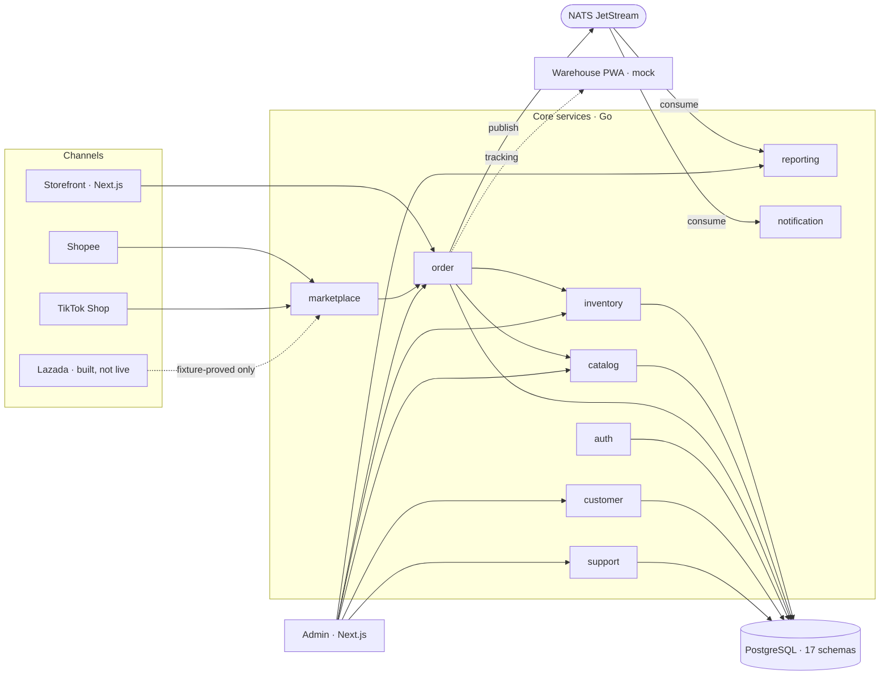
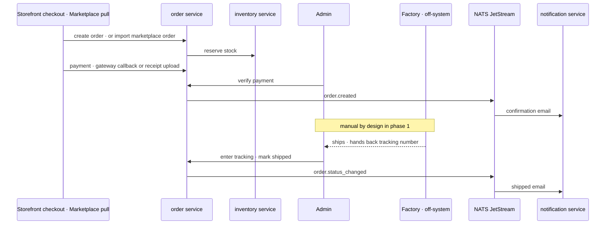
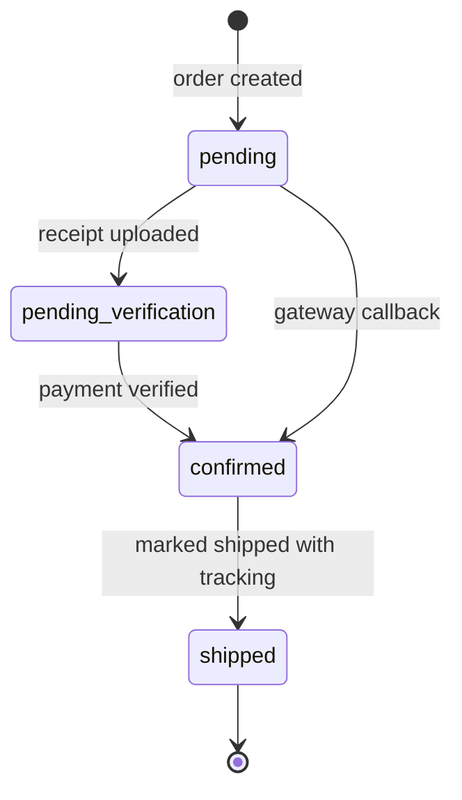

# Niaga

**A ten-service Go and Next.js e-commerce platform, built solo as the digital backbone of a Malaysian batik factory and now generalised into a channel-agnostic dropship storefront.**

| | |
|---|---|
| **Type** | Enterprise e-commerce platform, solo-built end to end |
| **Period** | 2023 → 2026 as *Desa Murni Batik*, renamed **Niaga** in 2026 |
| **Ran in production** | On a single VPS, 21 Docker containers, serving the factory's retail and marketplace operations. That deployment is now retired. The code is actively maintained and runs end to end on a local stack |
| **Visibility** | 18 of 21 repos are private. Two shared libraries and the org profile are public |
| **Public face** | [github.com/niaga-labs](https://github.com/niaga-labs) · [`lib-common`](https://github.com/niaga-labs/lib-common) · [`lib-ui`](https://github.com/niaga-labs/lib-ui) |

## Why

The factory needed to sell the same stock through its own storefront and through Shopee, TikTok Shop and Lazada without three disconnected back offices or double-counted inventory. Orders had to land in one place regardless of channel, stock had to reserve correctly across all of them, and a factory-direct fulfilment model had to work end to end before any of it could be automated further. The platform is now being pointed at a factory-direct dropship store first. Selling it to other companies is parked until that store has real sales.

## What was built

**Ten backend services**

| Service | Responsibility |
|---|---|
| auth | JWT, role-based access, two-factor (TOTP) |
| catalog | Products, variants, categories, flash sales, CMS pages. Apparel-specific surface behind a feature flag |
| inventory | Per-warehouse stock, transfers, low-stock alerts, Redis distributed locking. Single-warehouse mode by default |
| order | Cart, orders, payments, multi-courier shipping, invoices, refunds, returns. The largest service |
| customer | CRM, tiers, RFM segmentation, back-in-stock requests |
| marketplace | Shopee and TikTok Shop sync, live-capable. Lazada connect, order pull, webhooks, stock and catalog sync are complete but have only been proven against fixtures |
| notification | NATS JetStream consumer, 14 durable consumers across 5 streams. Email is real, SMS ships stubbed |
| reporting | Sales analytics, CSV and PDF exports |
| support | Tickets, categories, message threads |
| agent | Sales-agent commissions for the factory's reseller network. Legacy, behind a flag, off by default |

**Three frontends** on Next.js 14: the public storefront, the back-office admin (the largest repo by code and history), and a warehouse picking PWA that is honestly documented as a mock.

**Two public shared libraries:** [`lib-common`](https://github.com/niaga-labs/lib-common) (Go: config, DB, NATS, auth middleware, transactional outbox, saga, circuit breaker, bulkhead, retry, event catalog) and [`lib-ui`](https://github.com/niaga-labs/lib-ui) (shared React components).

**Data and infra:** one PostgreSQL 16 database with 17 schemas, schema-per-service isolation. A Docker Compose stack with nginx, NATS, MinIO, Meilisearch, Jaeger and Rembg. A Bruno smoke collection per HTTP service, run before every demo.

## Order flow

A marketplace order is normalised through one internal client so it lands as an ordinary order row, indistinguishable from a storefront order. That is the anti-corruption layer that lets the rest of the platform ignore where a sale came from.

## Engineering decisions

- **Multi-repo with a workspace root.** Nineteen independently versioned repos plus a root that holds only the repo map, the dev guide and cross-cutting docs, so each service and frontend keeps its own history and PR flow.
- **Schema-per-service in one Postgres instance.** Seventeen schemas in one database instead of one database per service. Service isolation was traded for single-VPS operability.
- **Event-driven sync with a transactional outbox**, hardened after a real incident. The order and notification services each defined the order-status event payload independently and drifted in five fields at once, silently: no error, no retry, no dead letter, and a shipped order sent the customer nothing. The fix moved the payload shape into one shared type in `lib-common`.
- **Shared inventory across channels**, with a single-warehouse default for phase 1 and the multi-warehouse transfer API kept but treated as legacy.
- **An honest rebrand.** Renaming the brand was nearly finished, but the domain model underneath still carried 8 apparel-specific tables, 22 columns and roughly 300 files touching tailoring, fabric and measurement concepts. Whether to generalise further was left open, with the real cost written down first.
- **An AI operating layer for the workspace itself.** Per-repo Claude Code memory, rules and guard hooks, including one that blocks bulk edits to migration files, so an autonomous coding session can pick up bounded units safely across 19 repos.
- **A Bruno smoke suite as the gate.** One collection per HTTP service, run before every demo, and the thing that tells a dead process apart from a genuinely broken endpoint.

## What is deliberately not claimed

Wholesale tiered pricing, multi-outlet stock and push notifications are not built. SMS is stubbed. The warehouse PWA is a mock. Lazada is complete in code but has never spoken to a live seller account. The sales-agent system is legacy and off by default. The production VPS is retired.

## By the numbers

| | |
|---|---|
| Repositories | 21, of which 18 private |
| Backend services | 10 |
| Frontend apps | 3 |
| Shared libraries | 2, both public |
| Marketplaces | Shopee and TikTok Shop live-capable, Lazada fixture-proved |
| Database | 17 schemas · 132 tables · 3 views · 73 foreign keys |
| Production topology | 21 Docker containers, now retired |
| Last full Bruno smoke run | 123 requests passed, 345 of 345 assertions |
| Tracked source | about 288,000 lines across 1,204 Go and TypeScript files |

## Stack

| Layer | Technology |
|---|---|
| Backend | Go 1.24, Gin, GORM |
| Frontend | Next.js 14 App Router, TypeScript, Tailwind CSS, shadcn/ui, Zustand, Framer Motion |
| Database | PostgreSQL 16, Redis 7 |
| Events | NATS JetStream, transactional outbox, durable consumers |
| Search and storage | Meilisearch, MinIO |
| Payments and shipping | Curlec FPX, Parcel Daily (16 couriers), Pos Laju, SF Express |
| Observability | OpenTelemetry to Jaeger, Sentry, Zap |
| Infra | Docker Compose, nginx |
